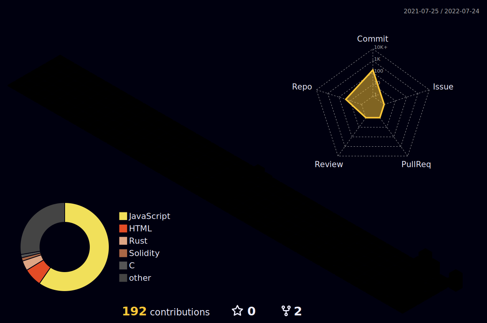

<h1 align="center"> </h1>

<h1 align="center">Hi 👋, I'm Ankush Dutta</h1>

<h3>Profile Visits</h3>

## 🙋‍♂️ About Me

- 🌱 I’m currently learning ** Solidity **

- 💬 Ask me about ** Blockchain **

- ⚡ Fun fact: I love to sleep!!

- 📫 How to reach me ** ankush.ad050203gmail.com **

 

<h3 align="center" > Connect with me: </h3>

  
  
  

 

<h3 align="center">Languages and Tools:</h3>

  
  
  
  
  
  
  
  
  
  
 

## 📊 My Github Stats

   
  
  |🎯 Github Streaks and Trophies 🏆| 🏆 Github Stats 🔭|
|----------------------------------|----------------------------|
| |

 

|🎯 Most used languages 🏆| 
|----------------------------------|
| | 

|  Contribution Stats  |
|----------------------|
|  |

  
  <b>Note:</b> Top languages is only a metric of the languages my public code consists of and doesn't reflect experience or skill level.

 
 

